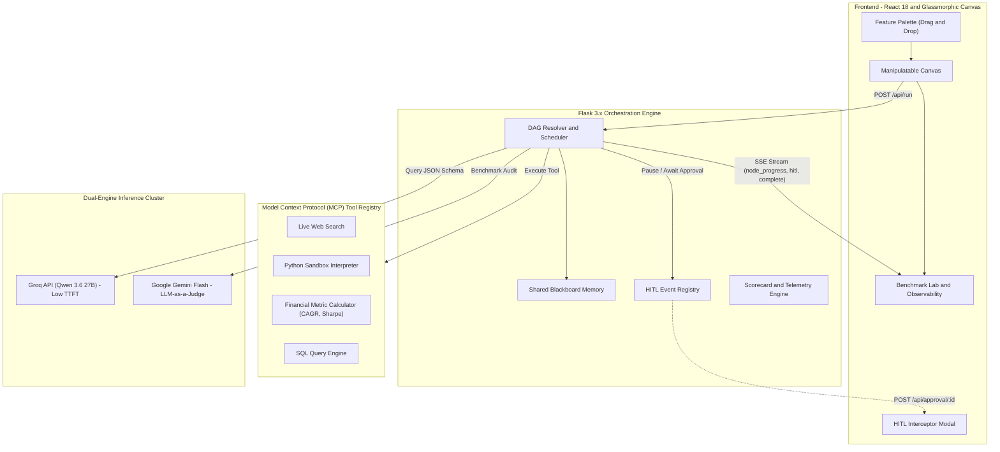

<div align="center">

# AgentVerse Pro
### *Enterprise Multi-Agent AI Orchestration, MCP Tool Protocol and Empirical Benchmarking Engine*

[](https://github.com/DheerajS-DM/aiharnessporject)
[](https://www.python.org/)
[](https://reactjs.org/)
[](https://vitejs.dev/)
[](https://flask.palletsprojects.com/)
[](https://groq.com/)
[](https://ai.google.dev/)
[](https://render.com/)
[](LICENSE)

<p align="center">
  <b>Directed Acyclic Graph (DAG) Execution</b> | <b>Model Context Protocol (MCP) Tools</b> | <b>Human-In-The-Loop (HITL) Governance</b> | <b>Empirical Latency and TTFT Benchmarks</b>
</p>

</div>

---

## Problem Statement: Scaling Collaborative AI Workflows

Monolithic Large Language Models often face reliability bottlenecks in enterprise workflows where prompt chains fail to maintain long-term state, cannot safely invoke external tools, or lack compliance checkpoints.

**AgentVerse Pro** addresses this by decomposing complex objectives into **modular, autonomous agent clusters**. Agents specialize in distinct cognitive roles (Market Analysts, Quantitative Modelers, Software Developers, QA Verifiers, and Risk Officers), exchange structured context through a shared blackboard memory bus, invoke tools via the **Model Context Protocol (MCP)**, enforce **Human-In-The-Loop (HITL)** governance, and benchmark every run quantitatively against latency, cost, and accuracy SLAs.

---

## System Architecture and Topology

AgentVerse resolves user workflows into a **Directed Acyclic Graph (DAG)**, computing topological execution levels and streaming state transitions over Server-Sent Events (SSE):



---

## Core Platform Capabilities

### 1. Manipulatable Canvas and Capability Board
* **Interactive Capability Palette**: Drag modular capability modules (Chain of Thought Reasoning, Self-Reflection, MCP Live Web Search, Python Sandbox, Financial Calculator, SQL Query, Human-In-The-Loop Checkpoint, Latency SLA Monitor) directly onto agent nodes.
* **Canvas Manipulation**: Zoom controls (45% to 180%), pan with grid snapping, viewport centering, and right-click context menu (Add Agent, Add HITL Gate, Add Evaluator, Reset View).
* **Bezier Connection Routing**: Real-time cubic Bezier curves with directional pulse animations during execution.
* **Port Snapping and Disconnect**: Interactive connection creation between ports and one-click connection deletion.

### 2. Model Context Protocol (MCP) Tool Registry
Modular tools adhering to Model Context Protocol interface conventions:

| Tool Name | Type | Description | Target Use Case |
| :--- | :--- | :--- | :--- |
| `web_search` | Real-time Search | Queries market data, company news, and technical specifications | Market research and context retrieval |
| `code_interpreter` | Isolated Sandbox | Evaluates dynamic Python scripts with math and numerical processing | Algorithmic testing and data analysis |
| `financial_calculator` | Quantitative Math | Computes CAGR, Sharpe Ratio, SIP return, and volatility metrics | Risk modeling and capital allocation |
| `sql_query` | Relational Store | Queries in-memory transaction logs and execution records | Ledger reconciliation and record retrieval |

### 3. Human-In-The-Loop (HITL) Governance Checkpoints
* **Controlled Execution Halts**: Pipelines pause when entering an `approval` checkpoint before downstream side-effects occur.
* **Thread Synchronization**: The backend engine pauses execution using thread-safe `threading.Event` synchronization while preserving connection state.
* **Interactive Interceptor**: The browser surfaces a governance modal displaying the proposed payload, allowing human operators to Approve, Reject, or Inject Feedback Guidance to resume execution.

### 4. Empirical Benchmarking and Observability Lab
* **Quantitative Scorecard**: Generates an automated composite benchmark score (0-100) and letter grade (A+, A, B+) based on 5 dimensions:
  1. *Reasoning and Accuracy* (Chain-of-Thought adherence)
  2. *MCP Tool Precision* (Parameter validity and execution consistency)
  3. *Latency SLA Efficiency* (Time-to-first-token and execution time)
  4. *Token Cost Optimization* (Cost per query in USD)
  5. *Multi-Agent Consensus* (Alignment across conversation rounds)
* **Real-Time Telemetry Dashboard**:
  - **Latency Waterfall Chart**: Visualizes per-agent TTFT (Time to first token) versus total generation latency.
  - **Token Velocity Tracking**: Telemetry views for token generation across topological stages.
  - **Audit Logs and Blackboard Explorer**: Interactive JSON state viewer for live shared memory.
* **Benchmark Report Export**: Export benchmark records in JSON or Markdown format for archiving and evaluation.

---

## Quickstart and Local Setup

### Prerequisites
* **Python**: 3.10+ (tested on Python 3.11 and 3.14)
* **Node.js**: 18+ (tested on Node 20+)
* **npm**: 9+

### 1. Clone the Repository
```bash
git clone https://github.com/your-username/agentverse.git
cd agentverse
```

### 2. Backend Setup
```bash
# Create and activate virtual environment
python -m venv venv

# On Windows (PowerShell):
.\venv\bin\Activate.ps1
# On Linux/macOS:
source venv/bin/activate

# Install backend dependencies
pip install -r backend/requirements.txt
```

### 3. Frontend Setup
```bash
cd frontend
npm install
npm run build
cd ..
```

### 4. Run the Platform

#### Development Mode (Concurrent Vite and Flask)
```bash
# Terminal 1 - Start Flask backend
python backend/main.py

# Terminal 2 - Start Vite frontend
cd frontend
npm run dev
```
Open `http://localhost:3000` in the browser.

#### Production Mode (Unified Single-Port Web Service)
```bash
# Start backend (serves built React dist from frontend/dist)
python backend/main.py
```
Open `http://localhost:8000` in the browser.

---

## Running the Automated Test Suite

An automated test suite verifies MCP tools, DAG execution, HITL approval routing, and API endpoints:

```bash
# Run tests inside the virtual environment
.\venv\bin\python.exe -m unittest tests/test_backend.py
```

Expected output:
```text
Ran 6 tests in 0.429s

OK
```

---

## Deployment to Render

AgentVerse is configured for deployment as a single unified web service on Render.

### Option A: Deploy via render.yaml Blueprint (Recommended)
1. Push this repository to GitHub.
2. Log into the Render Dashboard.
3. Select **New +** -> **Blueprint**.
4. Connect this repository; Render will automatically detect `render.yaml` and configure the service.
5. Click **Apply**.

### Option B: Manual Web Service Setup on Render
1. Select **New +** -> **Web Service**.
2. Connect your repository.
3. Configure the settings:
   - **Environment**: `Python 3`
   - **Build Command**: 
     ```bash
     pip install -r backend/requirements.txt && cd frontend && npm install && npm run build && cd ..
     ```
   - **Start Command**:
     ```bash
     gunicorn --chdir backend main:app
     ```
4. Click **Create Web Service**.

> **Note on Credentials**: API keys can be supplied via environment variables or entered dynamically in the browser settings dialog. If omitted, the platform defaults to **High-Fidelity Sandbox Mode**, allowing reviewers to test complete workflows without third-party credentials.

---

## Repository Directory Structure

```text
├── backend/
│   ├── main.py              # Flask REST and SSE streaming server + static frontend host
│   ├── orchestrator.py      # DAG execution, topological ordering, telemetry and HITL
│   ├── tools.py             # Model Context Protocol (MCP) tool registry
│   └── requirements.txt     # Python production dependencies (Flask, requests, gunicorn)
├── frontend/
│   ├── index.html           # HTML5 entry with typography and viewport definitions
│   ├── package.json         # React 18 and Vite 5 dependencies
│   ├── vite.config.js       # Vite configuration with /api reverse proxy
│   └── src/
│       ├── App.jsx          # Application state, DAG presets and SSE stream parser
│       ├── App.css          # Design system and layout styles
│       ├── components/
│           ├── Canvas.jsx                  # Graph board with zoom, pan, and drag-and-drop
│           ├── FeaturePalette.jsx          # Capability catalog (CoT, MCP, HITL)
│           ├── DraggableFeatureCard.jsx    # Capability cards
│           ├── OutputPanel.jsx             # Benchmark Lab and dialogue tracker
│           ├── SvgCharts.jsx               # Latency waterfall, scorecards and sparklines
│           ├── HitlInterceptorModal.jsx    # Human-in-the-loop operator checkpoint modal
│           └── Sidebar.jsx                 # Presets, node inspector and topology options
├── tests/
│   └── test_backend.py      # Automated unittest suite for MCP tools, HITL and API
├── render.yaml              # Render Blueprint deployment configuration
├── Procfile                 # Process configuration for cloud hosts
├── build.sh                 # Unified build script
└── README.md                # System documentation
```

---
